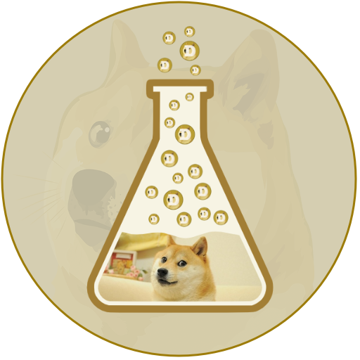

# test-pup

A Minimal test pup for Dogebox testing. 
Initially used to test pup upgrades.

## Version Management

The version is defined in `package.json` as the single source of truth. 

To update the version:
1. Update the version in `package.json`
2. Run `npm run sync-version` to sync it to `manifest.json` and `pup.nix`